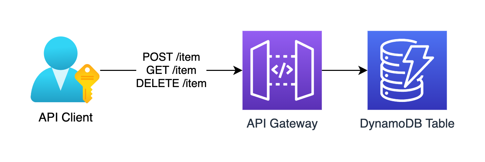

# Terraform AWS REST API DynamoDB Architecture Pattern

Terraform implementation of a commonly-used AWS architecture pattern of writing to & reading from a DynamoDB table using a REST API.



This solution deploys a REST API in AWS API Gateway which acts as a convenient wrapper to perform CRUD operations on any DynamoDB table. The API exposes the following endpoints:

- POST /item
- GET /item?table=my-table&id=1
- DELETE /item?table=my-table&id=1

POST Request Body:

```json
{
    "TableName": "my-table",
    "Item": {
        "id": {
            "S": "1"
        }
        ...
    }
}
```
